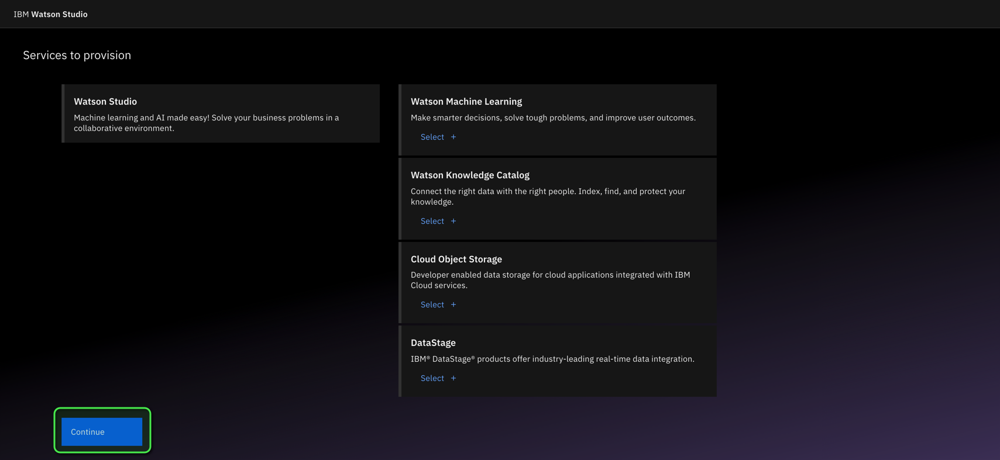

# c2ma-Setup Steps
Set up instructions for the workshop.  All that is required ahead of time is a valid email which you will use to create an IBM Cloud account.

## PAIRS API key
You should have been allocated a PAIRS API key against your own email.  If you do not have one then contact ???

Take the API key and create a file called "pairpass.txt" on your own laptop.

## Create an IBM Cloud account

Click on [https://ibm.biz/COP26-workshop-2021](https://ibm.biz/COP26-workshop-2021)

Fill in Account information, email and other information as required.  You will receive a verification code to the email you specified.  Note that this code is only valide for 30 minutes.

Enter the Verification code and then an Personal Information (like password and country). 

Read the IBMid Account Privacy information and if you agree with it, scroll down and click Proceed.

You now have an IBM Cloud account which is linked to your email.

You will see a Welcome message, if you wish to have a Tour then click "Show me" otherwise click "Maybe later".  We recommend to click "Maybe later" for now.

You are presented with the initial screen of services available for you.  Note : you have what is called a "Lite" account which means that you can have access to the Free/Lite resources of each of the Services and can investigate their functionality without charge.  

We (IBM) have provided additional IBM credit in  a particular account which gives you additional access to Services above the Lite Plan. This is described further down in this README.

## 
## Setup Watson Studio Service

Login the IBM Cloud

Click on Create Resources

Type "Watson Studio" in the search bar and click the "Watson Studio" item

For Select a location, pick "London (eu-gb)" - this might be the default for you anyway.  The Lite Plan is automatically selected.

Click "Create"

Wait a few seconds and the Watson Studio instance will be shown.

Click "Get Started"

Enter some further information.  NOTE : you need to pick your international code froom the drop down and then enter your telephone number in the field next to the code otherwise the Continue button will not be enabled.

Click "Continue"

A range of Services to provision will be shown, for now click "Continue"

Watson Studio is configured.

Click "Go to IBM Watson Studio"

If you receive any survey prompt - ignore them and continue.  Also, you will be prompted for a "Welcome to Cloud Pak for Data" tour - click the cross to skip this tour.

You will now see the main Watson Studio dashboard

Click on "New Project"

TODO : need to explain how to get the pairpass.txt file into the Projects area so the Notebooks can access it. Do I do this while creating a the first Project with the very simple Notebook just to test you can connect to PAIRS ?  it depends on how Anne wishes for the teams to work (i.e. one Project, multiple people, multiple Notebooks, one pairpass.txt file that all Notebooks access, so only using one PAIRS API key of one of the people).

Click on "Create an empty project"

Before a project can be create, it needs somewhere to be saved to.  Watson Studio using Cloud Object Storage (COS) to save it's artifacts into.

NOTE : you only need to create the COS storage once and then after that all your projects will be stored in it.

Click "Add"

NOTE : A new Tab will be opened in your browser

Leave the Lite Plan as shown and click "Create"

NOTE : No prompt appears that the storage has been successfully created.  Return back to the Tab where you clicked "Add" and refresh the whole page in your browser

Enter a project name "test-<add something unique>" followed by your initials or something unique and then click "Create"

Cancel any prompt on a Tour

You will see your project main screen

On the main screen click "Add to project" and then click on "Data"

You will be presented with an option to Upload a file

Drag or click Browse to upload your pairspass.txt file

Check the file has been uploaded succesffuly

Now you need to carry out some project type settings.  Click on the Settings Tab

Scroll down to the Access tokens section and click on "New token +"

Enter a Name and pcik Editor for "Access role for project" pick Editor and then click Create

View the token 

Cut/paste the valuet to a file on your laptop - we will use this within a Notebook later on

Click on the Projects link

Then click on your project (for example test-sjk) and look at the URL of the browser and copy and save away the ProjectID.  Again, this will be used in a Notebook

### Import sample Notebook to Watson Studio

### Test the Notebook
